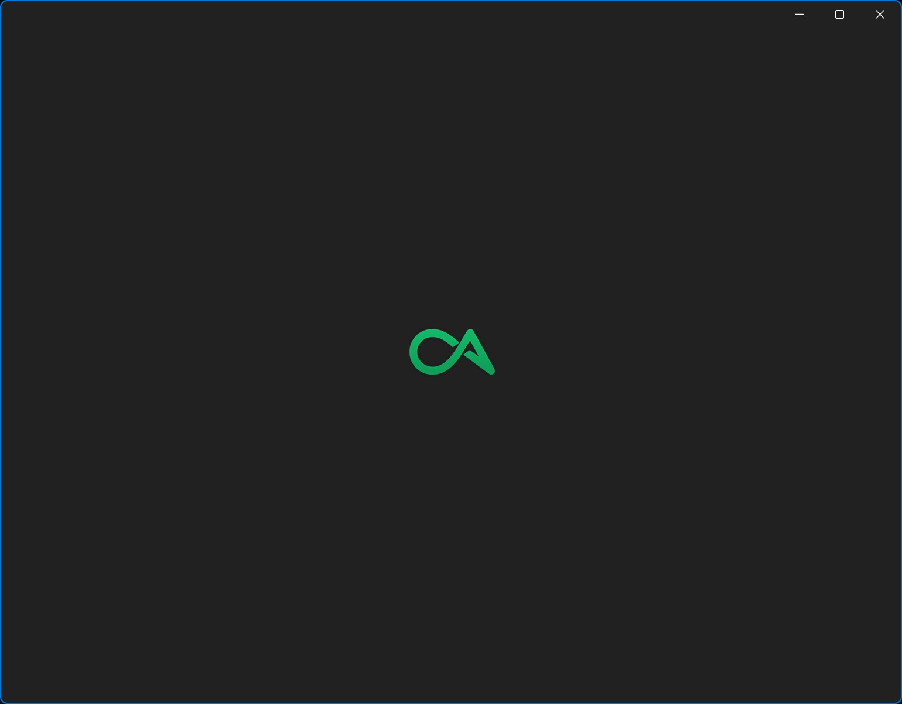
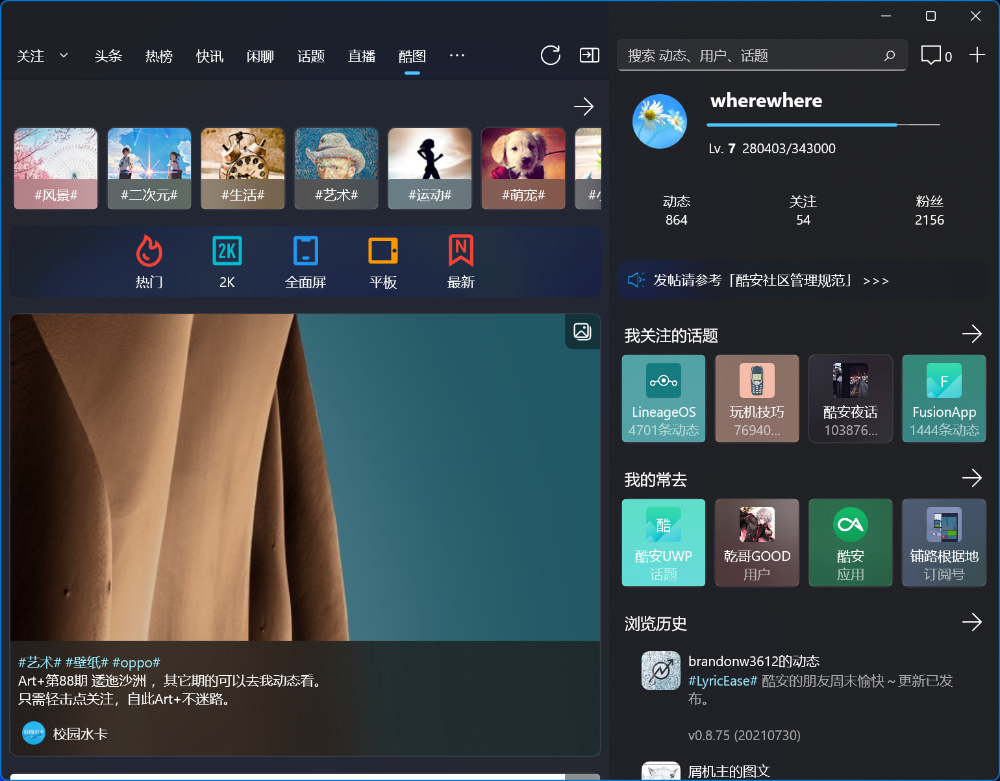
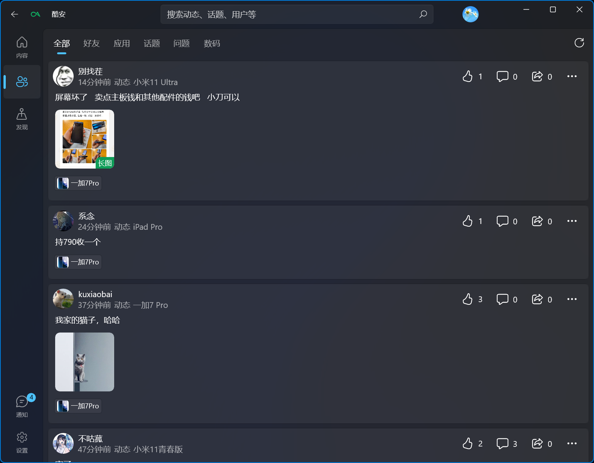
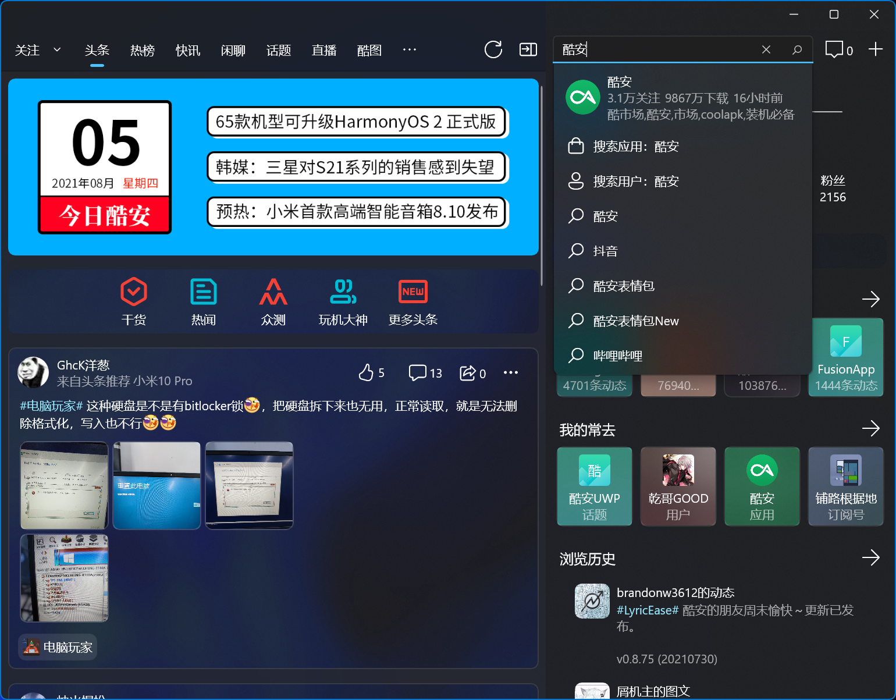
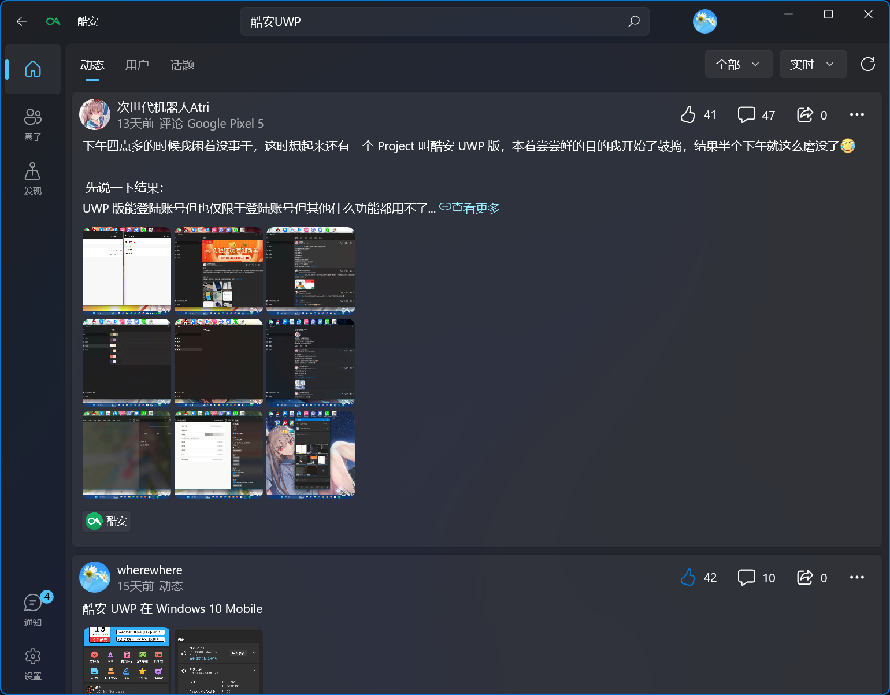
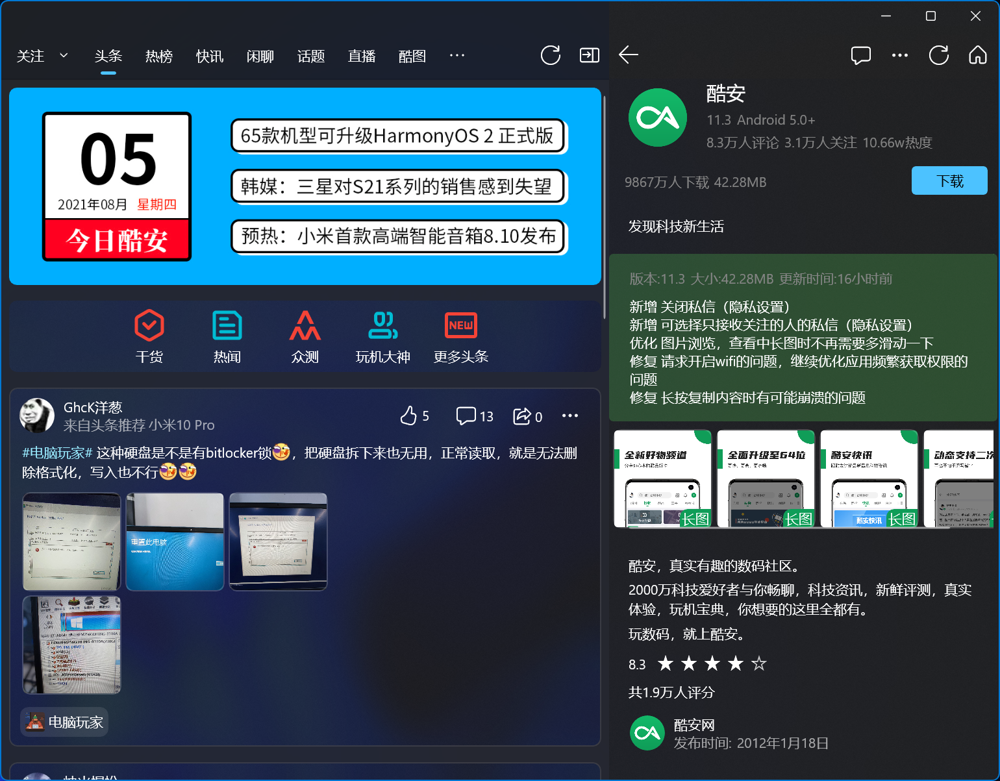
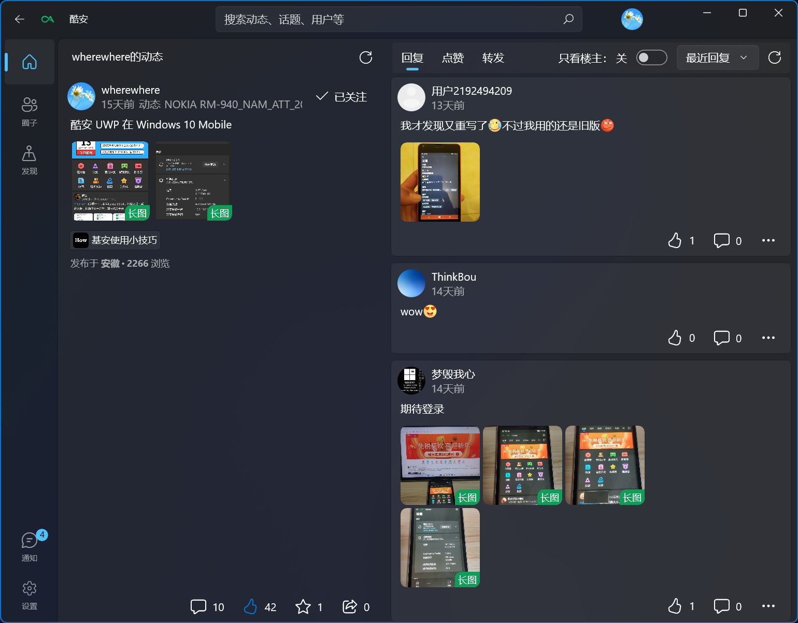

# Coolapk WinUI

一个基于 [WinUI 3](https://github.com/microsoft/microsoft-ui-xaml) 的第三方酷安（Coolapk）客户端，延续自 [Coolapk-UWP](https://github.com/Coolapk-UWP/Coolapk-UWP)（原作者 [@oboard](https://github.com/oboard)）。

## 目录

- [Coolapk WinUI](#coolapk-winui)
  - [目录](#目录)
  - [声明](#声明)
  - [现有功能](#现有功能)
  - [屏幕截图](#屏幕截图)
  - [如何安装应用](#如何安装应用)
    - [最低需求](#最低需求)
    - [从 Microsoft Store 安装](#从-microsoft-store-安装)
    - [从 GitHub Releases 安装](#从-github-releases-安装)
  - [从源码构建](#从源码构建)
  - [使用到的模块](#使用到的模块)
  - [参与人员](#参与人员)
  - [鸣谢](#鸣谢)

## 声明

1. 本程序是[酷安](https://coolapk.com)的第三方客户端，仅用作学习交流使用，禁止用于商业用途。
2. 本程序是开源软件，因此，在使用时请确保程序是来自[本 GitHub 仓库](https://github.com/CodeForCSharp/Coolapk-WinUI)或应用商店中的[本应用](https://www.microsoft.com/store/apps/9N0DMXZVMQVL)，以确保您的数据安全。
3. 若程序来源无异常，程序运行过程中您的所有数据都仅用于与酷安的服务器交流或储存于本地，开发者不会窃取您的任何数据。但即便如此，也请注意使用环境的安全性。
4. 若您对[酷安](https://coolapk.com)如何处理您的数据存在疑虑，请访问[酷安用户服务协议](https://m.coolapk.com/mp/user/agreement)、[酷安隐私保护政策](https://m.coolapk.com/mp/user/privacy)、[酷安二手安全条约](https://m.coolapk.com/mp/user/ershouAgreement)。

## 现有功能

1. 夜间模式 / 跟随系统主题
2. 登录、点赞、关注、评论
3. 浏览首页头条、酷图与关注动态
4. 浏览动态、图文、问答、通知
5. 搜索动态、用户、话题、应用等
6. 应用 / 商品 / 话题 / 数码 / 收藏等详情页
7. 查看图片（缩略图 / 原图）与 Web 内容
8. 简中 / 繁中 / 英文多语言
9. 更多内容请自行发掘 

## 屏幕截图

- 启动图

  

- 首页

  
  
  

- 通知

  

- 搜索

  
  

- 应用详情

  

- 动态

  
  

- 图文

  

- 问答

  

## 如何安装应用

### 最低需求

- Windows 10 版本 1809（Build 17763）及以上
- 设备需支持 x64 / x86 / ARM64
- 应用为自包含部署，无需额外安装 Windows App Runtime

### 从 Microsoft Store 安装

点击上方 [Microsoft Store 徽标](https://www.microsoft.com/store/apps/9N0DMXZVMQVL) 或在本机 Microsoft Store 中搜索 “Coolapk” 安装。

### 从 GitHub Releases 安装

1. 前往 [Releases](https://github.com/CodeForCSharp/Coolapk-WinUI/releases/latest) 下载最新的 `.msix` 安装包。
2. 双击 `.msix` 文件，在弹出的安装程序中点击「安装」，坐和放宽。

> 若要绕过商店侧载安装，请在「设置 → 系统 → 开发者选项」中开启「开发人员模式」。

## 从源码构建

1. 安装 [Visual Studio 2022](https://visualstudio.microsoft.com/)（含「使用 C++ 的桌面开发」或 Windows 应用 SDK 依赖）。
2. 安装 [.NET 10 SDK](https://dotnet.microsoft.com/download/dotnet/10.0) 与「Windows 应用 SDK C# 模板」工作负载。
3. 使用 Visual Studio 打开 `CoolapkUWP.sln`，选择目标平台（x64 / x86 / ARM64）与配置（Debug / Release）后构建。

> Release 配置默认启用 AOT 编译（`PublishAot`）与裁剪（`PublishTrimmed`），以减小体积并提升启动速度。

## 使用到的模块

- [Windows App SDK](https://github.com/microsoft/WindowsAppSDK)（WinUI 3）
- [Windows Community Toolkit](https://github.com/CommunityToolkit/WindowsCommunityToolkit)（Converters / Helpers / Mvvm）
- [System.Text.Json](https://learn.microsoft.com/dotnet/standard/serialization/system-text-json/source-generation)（源生成，替代 Newtonsoft.Json）
- [Microsoft.Extensions.Logging](https://learn.microsoft.com/dotnet/core/extensions/logging)（文件日志，替代 MetroLog）
- [HtmlAgilityPack](https://html-agility-pack.net/)
- [Aliyun.OSS.SDK.NetCore](https://github.com/aliyun/aliyun-oss-csharp-sdk)（图片上传）
- [BCrypt.Net-Next](https://github.com/BcryptNet/bcrypt.net)（Token 生成）
- [QRCoder](https://github.com/codebude/QRCoder)（二维码）
- [WebView2](https://developer.microsoft.com/microsoft-edge/webview2/)（网页浏览）
- [UnicodeStyle](https://github.com/terlar/UnicodeStyle)

## 参与人员

## 鸣谢

- 酷安 UWP 原作者 [@一块小板子](http://www.coolapk.com/u/695942)（[Github](https://github.com/oboard)）
- 原项目 [Coolapk-UWP](https://github.com/Coolapk-UWP/Coolapk-UWP) 及所有为其做出贡献的同志们
- Token 获取方法参考 [CoolapkTokenCrack](https://github.com/ZCKun/CoolapkTokenCrack)（[@ZCKun](https://github.com/ZCKun)）与 [FuckCoolapkTokenV2](https://github.com/XiaoMengXinX/FuckCoolapkTokenV2)（[@XiaoMengXinX](https://github.com/XiaoMengXinX)）
- **铺路尚未成功，同志仍需努力！**

## 许可证

本项目基于 [GPL-3.0](LICENSE) 许可证发布。
